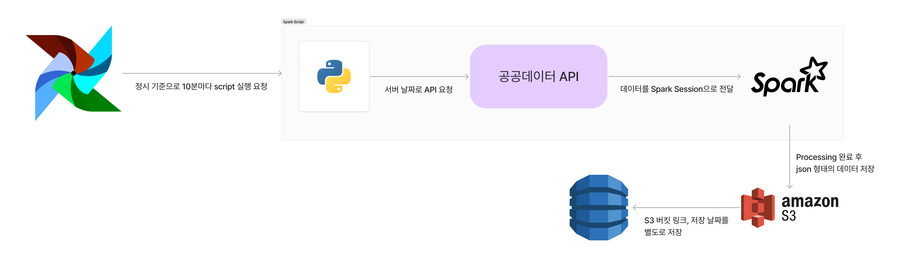
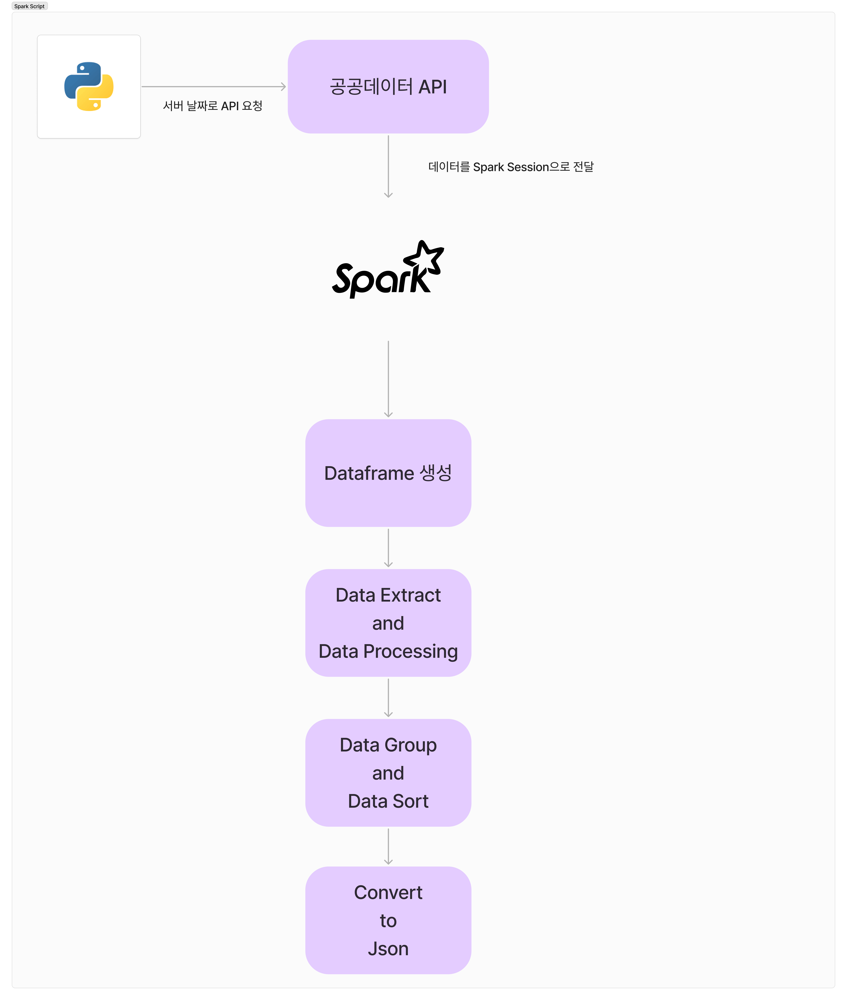
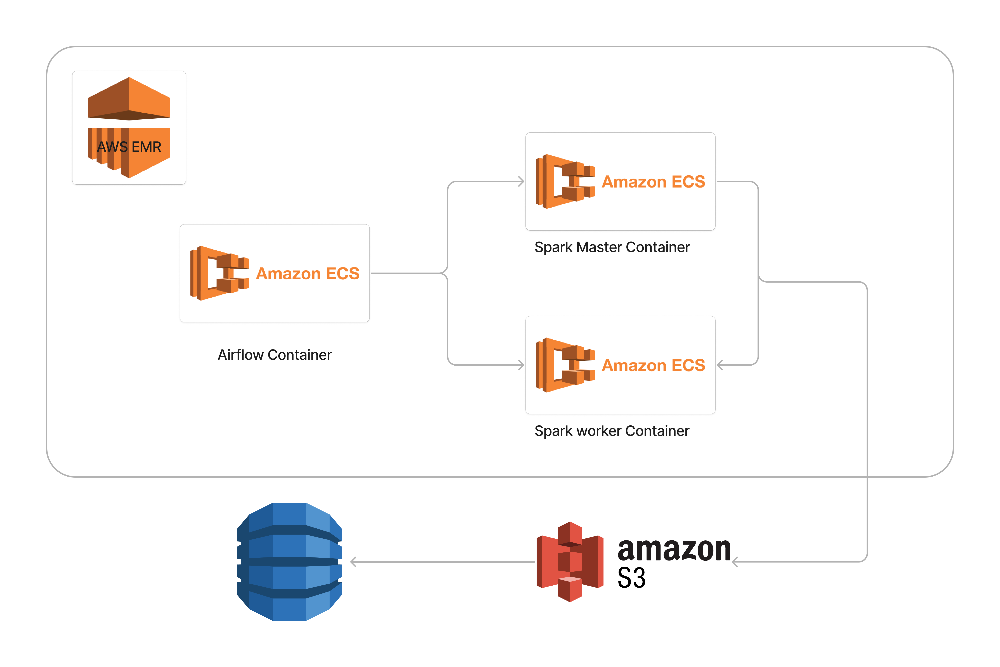

# 재난방지문자 수집 파이프라인
## 개요
전국 각 지역마다 시시때때로 다르게 오는 재난 문자의 내용을 수집한다.
이를 모아서 각 지역에 어느 메세지가 언제 왔는지 확인 할 수 있도록 확인 할 수 있도록 했다.
이를 서비스화 한다면 전국의 재난 문자를 시간 별로 확인 할 수 있도록 데이터를 수집하는 파이프라인으로 사용 가능하다고 판단되어 진행했다.
## 구조

- Airflow를 이용해서 특정한 시간 간격을 두고 스크립트 실행 반복을 스케쥴링 하였다.
- 이를 통해서 공공데이터 API에서 json 형태의 데이터를 불러와 Dataframe 생성 및 원하는 조건에 맞춰 데이터를 변형하고 이를 UDF 형태로 만들어 Json으로 저장하는 과정을 거친다.
- 이후 S3에 데이터를 저장하고, 외부 서비스에서 활용을 용이하게 하도록 S3에 접근 가능한 link, 최신화 시간과 함께 고유 ID를 저장한다.  
(아직 구현이 안된 사항이다.)

- 총 4가지 과정을 거쳐서 데이터를 가공한다.
1. Dataframe 생성  
Dataframe을 생성해서 Json 형태로 들어오는 데이터를 SparkSQL로 가공이 가능하도록 변형한다.
2. Data Extract and Processing  
데이터를 올바르게 Group 및 Sort 할 수 있도록 데이터를 추출하고 데이터의 구조를 변경한다.  
주로 데이터를 지역 별로 구분하며 도, 특별시, 광역시 등을 Primary key로 설정할 수 있도록 하고 시, 군, 구 혹은 특별시 등의 동, 구를 Secondary key로 설정할 수 있도록 한다.
3. Data Group and Sort  
SparkSQL을 사용해서 지역 별로 Group By하고 이 내용들을 시간 순으로 정렬하여 최신 데이터를 확인 할 수 있도록 한다.
4. Convert to Json  
데이터들을 UDF로 설정하여 필요에 맞게 Nullable 등을 지정하고 저장 형태를 변형할 수 있도록 한 뒤, 필요에 맞게 json으로 변환하도록 한다.
## 배포 방향
배포는 아래 flow를 따라 진행한다.  
(아직 진행하지 않은 상황이다.)

ETL 파이프라인의 기초적인 배포 프로세스라고 생각한다.

먼저, AWS EMR은 HDFS 환경을 지원하는 AWS의 빅데이터 전용 플랫폼이다.  
EMR 상에서는 EC2, ECS, EKS 등 가상환경 혹은 가상 컨테이너나 클러스터 서비스를 실행하여, 그 환경 내에서 HDFS를 사용할 수 있도록 한다.  

프로젝트에서 가져오는 데이터의 양이 평시에는 하루 평균 150개 정도 되는 분량의 파일이라 크기가 작을 수 있으나, 긴급상황이나 돌발상황에는 재난 문자가 짧은 시간에 많은 양이 전국으로 전송되기 때문에 그에 대비하여 HDFS를 적용해 분산처리를 유리하게 진행할 수 있는 환경을 조성한다.

Docker-Compose를 이용해서 개발환경을 구성했으므로 그에 맞춰서 ECS를 이용해서 컨테이너로 Airflow와 Spark를 실행하도록 배포하며, Spark 특성상 Master 노드와 Worker 노드를 구분하기 때문에 그에 맞춰 컨테이너를 별개로 실행하도록 진행한다.

또한 Spark에서 실행한 결과물은 바로 S3에 저장되며, 저장과 동시에 S3의 링크와 데이터 생성 시간을 고유 ID와 함께 외부 서비스에서 활용이 용이하도록 DynamoDB에 저장하여 DB의 사용비용 최소화와 동시에 대량을 데이터를 손쉽게 사용할 수 있도록 한다.